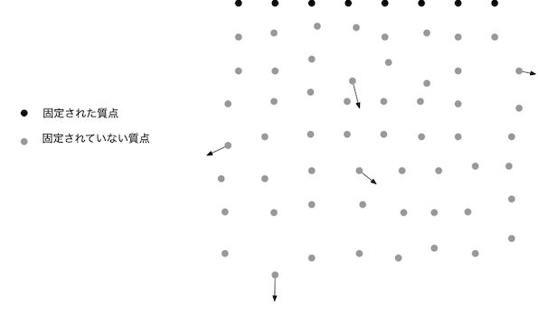
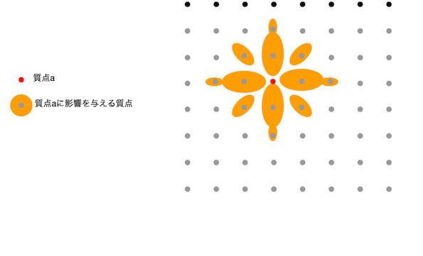
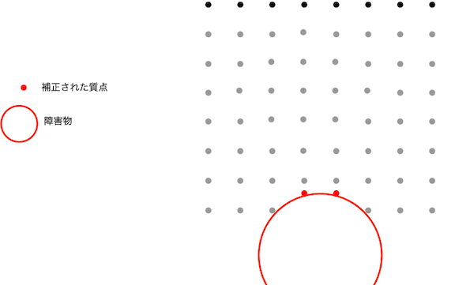

# cloth
格子状に並べた質点同士を仮想のバネで拘束することで布シミュレーションを行う。

# 準備
リポジトリをクローンしcloth.htmlをWebブラウザに読み込ませることで動作確認できるが、その前準備として以下のリポジトリ
three.js

[https://github.com/mrdoob/three.js.git](https://github.com/mrdoob/three.js.git)


の中から
```
build/three.js
examples/js/controls/TrackballControls.js
```
を、こちらのjsディレクトリにコピーする必要がある。

# 説明 

### 質点
位置と質量を持ち、格子状に配置され布を表現する。

js/Cloth.js
```javascript:js/Cloth.js
ClothNode = function(param) {}
```

### 布
経過時間ごとにupdateを呼び出し、質点の位置を更新する。更新は3段階で行われる。

js/Cloth.js
```javascript:js/Cloth.js
Cloth = function(segment_count) {
  //  質点（ClothNode）の準備
}

Cloth.prototype = {
    constructor: Cloth,
    
    update: function(dt) {
        this.compute_constraint_free(dt);  // 第1段階
        this.compute_constraint(dt);　// 第2段階
    },
    compute_constraint_free: function(dt) {},
    compute_constraint: function(dt) {}
}
```
Cloth-collision.js
```javascript:js/Cloth-collision.js
Cloth.prototype.update_sphere_collision = function(pos, radius) {} // 第3段階
```

## 第1段階
固定されていない質点を、質点が移動しようとする向きや重力の向きに合わせてそのまま移動させる。



## 第2段階
固定されていない全質点に対し、自分に影響を与える質点との位置関係に基づいて位置補正する。



## 第3段階
固定されていない全質点に対し、障害物にめり込まないように位置を補正する。


